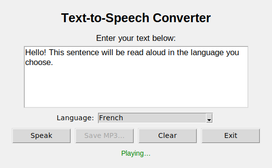

# Text-to-Speech

[](https://github.com/FuaadBashi/Text-To-Speech-Generator/actions/workflows/ci.yml)

A desktop app that reads your text aloud in any of 60+ languages. Type or paste text, pick a
language, press **Speak**, and save the result as an MP3 if you want to keep it. Built with
Tkinter and Google Text-to-Speech (gTTS).

<p align="center"></p>

## Highlights

- **Responsive UI.** Synthesis is a network call, so it runs on a worker thread that reports back
  through a queue polled by the Tk event loop. The window never freezes.
- **Cross-platform playback.** Uses `afplay` on macOS, the default handler on Windows, and
  `ffplay`, `mpg123` or `xdg-open` on Linux. Commands are passed as argument lists, never through
  a shell.
- **Readable failures.** Empty text, an unsupported language or no network connection shows a
  message in the window instead of a traceback in the terminal.
- **Testable core.** `speech.py` has no Tkinter dependency, and the TTS engine is injectable, so
  the tests run offline with a fake engine.

## Getting started

Requires Python 3.10+ with Tkinter (included in the python.org installers; on Debian and Ubuntu,
`sudo apt install python3-tk`) and an internet connection for synthesis.

```bash
git clone https://github.com/FuaadBashi/Text-To-Speech-Generator.git
cd Text-To-Speech-Generator
python3 -m venv .venv && source .venv/bin/activate
pip install -r requirements.txt
python main.py
```

## Project structure

```
main.py      Tkinter window, worker thread, result queue
speech.py    synthesis, language list, per-OS playback (no UI code)
tests/       pytest suite with a fake TTS engine
```

## Tests

```bash
pip install -r requirements.txt pytest ruff
pytest
ruff format --check . && ruff check .
```
